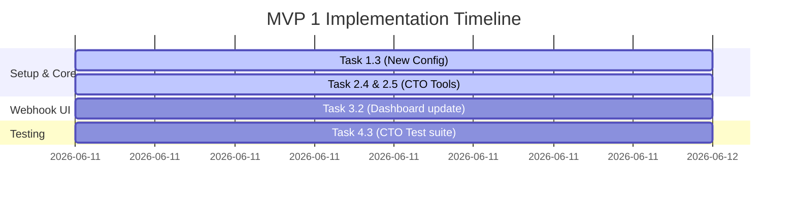

# Implementation Plan: PocketDev Core Dev Agent (MVP 1)

* **Plan Code:** 0001-260611-pocketdev-core-agent-plan
* **Associated Spec:** 0001-260611-pocketdev-core-agent
* **Created Date:** June 11, 2026
* **Status:** In Progress
* **Authors:** Antigravity (AI Coding Assistant) & User

---

## 1. Task List

### Phase 1: Environment Setup & Configuration
* [x] **Task 1.1:** Initialize project and create `requirements.txt`.
* [x] **Task 1.2:** Create `.env.example` and load settings safely in `app/config.py`.
* [x] **Task 1.3:** Add `TELEGRAM_GROUP_CHAT_ID` configurations to `.env.example` and `app/config.py`.

### Phase 2: Core Module Development
* [x] **Task 2.1:** Write the `app/telegram_bot.py` helper to send messages back to Telegram.
* [x] **Task 2.2:** Build GitLab API wrappers in `app/tools/gitlab_tools.py` using `python-gitlab`.
* [x] **Task 2.3:** Implement `app/agent.py` to configure the Gemini Agent and register the GitLab tools.
* [x] **Task 2.4:** Build team coordination and IDE Agent supervision tools in `app/tools/team_tools.py`.
* [x] **Task 2.5:** Register new tools in `app/tools/__init__.py` and configure Gemini mapping.

### Phase 3: Webhook Server & Memory Persistence
* [x] **Task 3.1:** Implement `app/main.py` FastAPI server, the `/webhook/telegram` endpoint, and simple JSON-based local history persistence.
* [x] **Task 3.2:** Update Dashboard UI in `app/main.py` to reflect Team Group Chat and IDE Agent connectivity status.

### Phase 4: Testing & Packaging
* [x] **Task 4.1:** Write quick setup instructions in `README.md`.
* [x] **Task 4.2:** Run local integration tests and simulate webhook requests.
* [x] **Task 4.3:** Add integration tests for Team/IDE simulation tools and verify.

---

## 2. Timeline & Progress Tracking

